# Serverless_Framework_Athena_Glue_Deployment_on_existing_S3_Bucket

## Description
AWS Athena, Glue Database, Glue Crawler deployment on existing S3 bucket through Serverless (sls) Framework.

## Overview
Serverless is a cloud-native development model that allows developers to build and run applications without having to manage servers. There are still servers in serverless, but they are abstracted away from app development.  
Or you can say Serverless is an application delivery model where cloud providers automatically intercept user requests and computing events to dynamically allocate and scale compute resources, allowing you to run applications without having to provision, configure, manage, or maintain server infrastructure.

## Serverless Framework
Develop, deploy, troubleshoot, and secure your serverless applications with radically less overhead and cost by using the Serverless Framework. The Serverless Framework consists of an open-source CLI and a hosted dashboard. Together, they provide you with full serverless application lifecycle management.

# Setting Up the Serverless Framework with AWS

## Step - 1
Login to your AWS account, go to the IAM (Identity and Access Management) console, click the “Users” from left navigation panel and click on the “Add users” button  

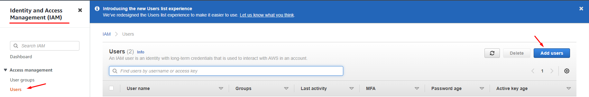  

Add user name and check box “Access key - Programmatic access” and click “Next Permissions” button  

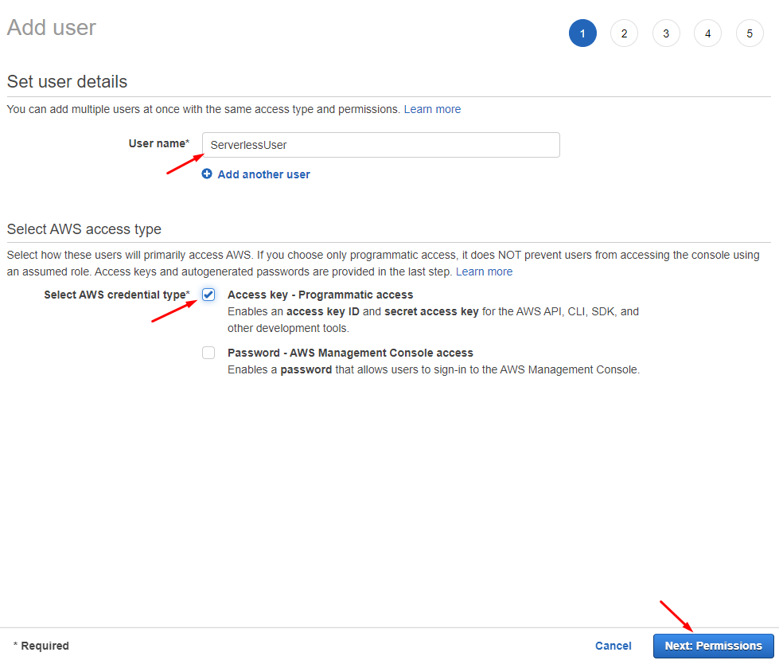  

Click on “Attach existing policies directly”, check box “AdministratorAccess” and click on “Next: Tags” button  

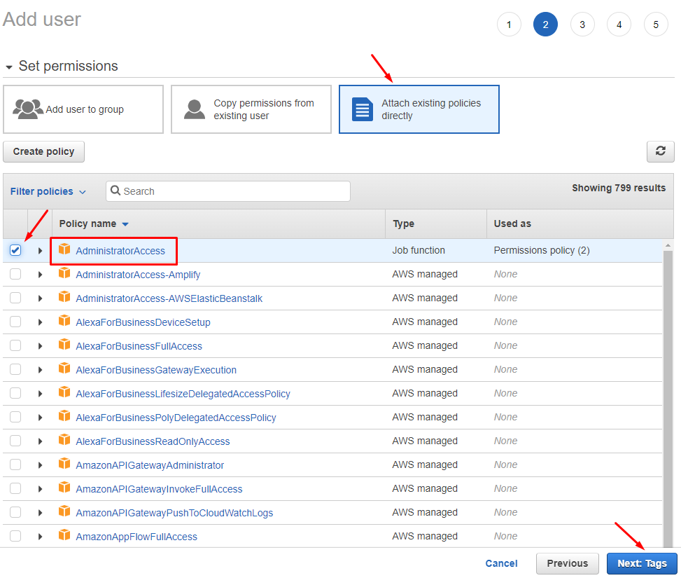  

Add Key, Value as required and click on “Next: Review” button  

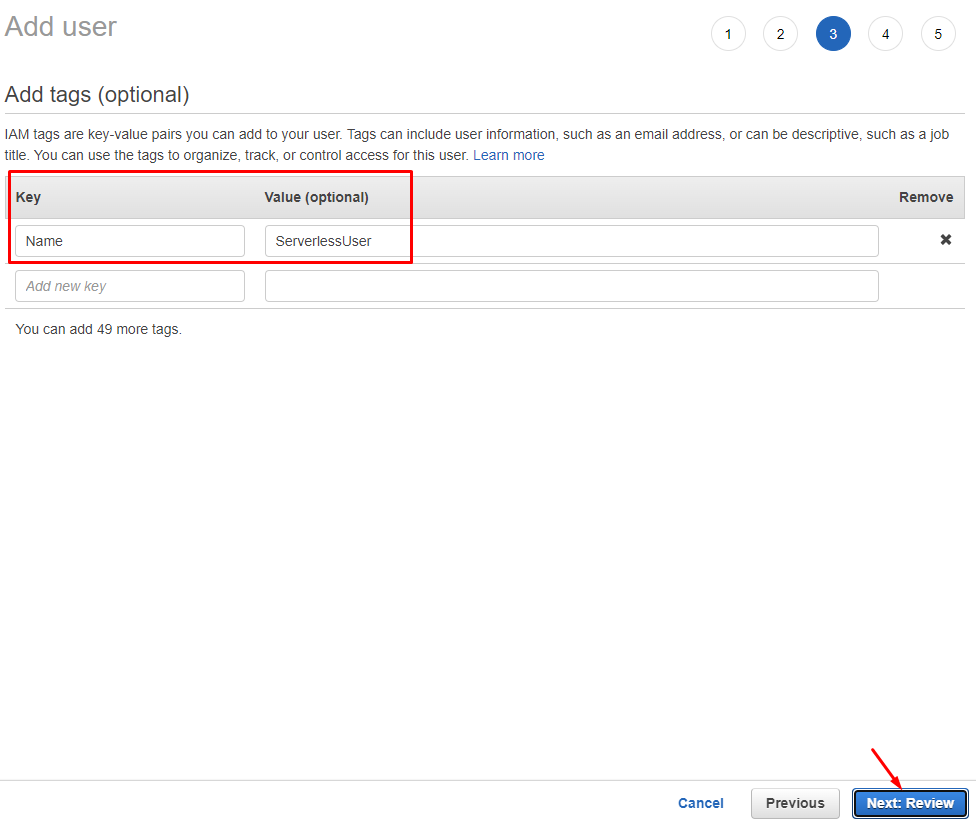  

Click on “Create user” button to create user  

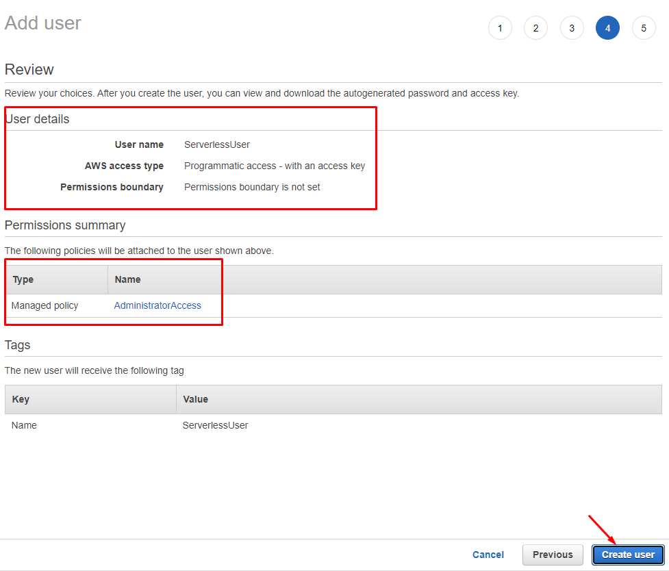  

Finally download .csv credentials file and secure it so no one have access and click on “Close” button  

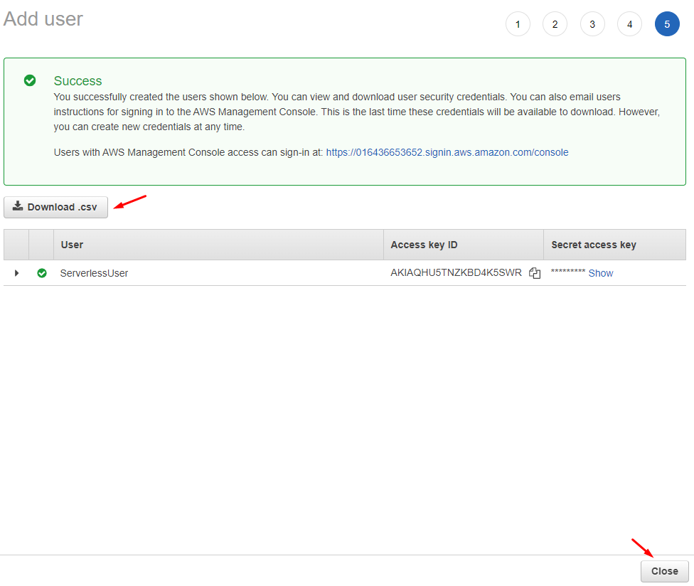  

Your ServerlessUser created.  

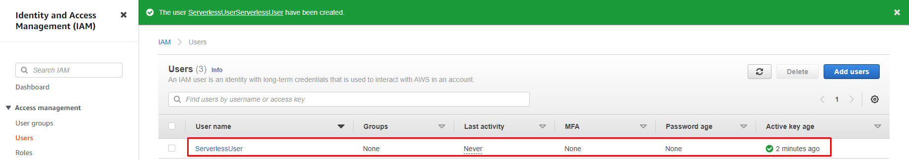  

## Step - 2
Login to your linux server to configure serverless. Before installing serverless you need to install nodejs package if it’s already installed then you can proceed with serverless installation otherwise you can install through given commands.  

```
$ apt update
```  

```
$ curl -fsSL https://deb.nodesource.com/setup_18.x | sudo -E bash -
```  

```
$ apt install -y nodejs
```  

Check install version with the commands  

```
$ node -v
```  

```
$ npm -v
```  

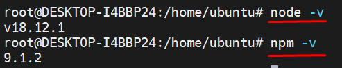  

Following command install the serverless package  

```
$ npm install -g serverless
```  

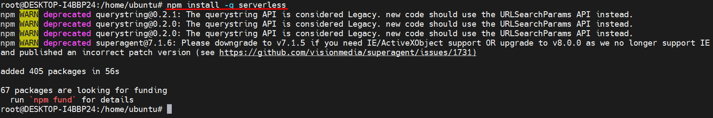  

To setup Serverless with AWS run the following command  

```
$ serverless config credentials --provider aws --key your-account-key --secret your-account-secret --profile ServerlessUser
```  

  

Use the credentials of the user you created in first step

## Step - 3
Now we have to create our first project to deploy our resources on AWS for that we can do it by two ways as  

#### **Way - 1**
Create a project directory with command  

```
$ mkdir athena-project
```  
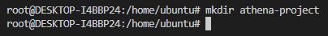  

```
$ cd athena-project
```  

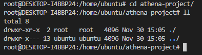  

```
$ sls create --template aws-nodejs
```  

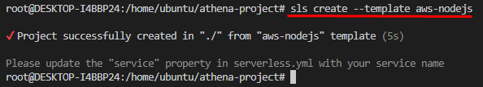  

Command will create three files in your project directory in which serverless.yml is the main file you can edit and configure for your project resources.  

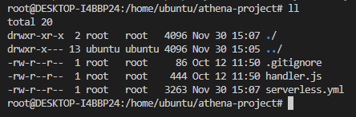  

#### Way - 2
Run the following command directly create your project with directory and all files as  

```
$ sls create --template aws-nodejs --path athena-project
```  

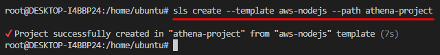  

Go into the project directory and check  

```
$ cd athena-project
```  
```
$ ls
``` 

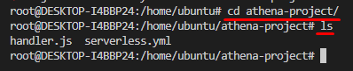  

## Step - 4
Basic serverless.yml file look like this which you have to edit with your project code. To view it run command.  

```
$ cat serverless.yml
```  

```yaml
# Welcome to Serverless!
#
# This file is the main config file for your service.
# It's very minimal at this point and uses default values.
# You can always add more config options for more control.
# We've included some commented out config examples here.
# Just uncomment any of them to get that config option.
#
# For full config options, check the docs:
#    docs.serverless.com
#
# Happy Coding!

service: athena-project

# app and org for use with dashboard.serverless.com
#app: your-app-name
#org: your-org-name
# You can pin your service to only deploy with a specific Serverless version
# Check out our docs for more details

frameworkVersion: '3'

provider:
  name: aws
  runtime: nodejs12.x

# you can overwrite defaults here
#  stage: dev
#  region: us-east-1

# you can add statements to the Lambda function's IAM Role here
#  iam:
#    role:
#      statements:
#        - Effect: "Allow"
#          Action:
#            - "s3:ListBucket"
#          Resource: { "Fn::Join" : ["", ["arn:aws:s3:::", { "Ref" : "ServerlessDeploymentBucket" } ] ]  }
#        - Effect: "Allow"
#          Action:
#            - "s3:PutObject"
#          Resource:
#            Fn::Join:
#              - ""
#              - - "arn:aws:s3:::"
#                - "Ref" : "ServerlessDeploymentBucket"
#                - "/*"

# you can define service wide environment variables here
#  environment:
#    variable1: value1

# you can add packaging information here
#package:
#  patterns:
#    - '!exclude-me.js'
#    - '!exclude-me-dir/**'
#    - include-me.js
#    - include-me-dir/**

functions:
  hello:
    handler: handler.hello

#    The following are a few example events you can configure
#    NOTE: Please make sure to change your handler code to work with those events
#    Check the event documentation for details
#    events:
#      - httpApi:
#          path: /users/create
#          method: get
#      - websocket: $connect
#      - s3: ${env:BUCKET}
#      - schedule: rate(10 minutes)
#      - sns: greeter-topic
#      - stream: arn:aws:dynamodb:region:XXXXXX:table/foo/stream/1970-01-01T00:00:00.000
#      - alexaSkill: amzn1.ask.skill.xx-xx-xx-xx
#      - alexaSmartHome: amzn1.ask.skill.xx-xx-xx-xx
#      - iot:
#          sql: "SELECT * FROM 'some_topic'"
#      - cloudwatchEvent:
#          event:
#            source:
#              - "aws.ec2"
#            detail-type:
#              - "EC2 Instance State-change Notification"
#            detail:
#              state:
#                - pending
#      - cloudwatchLog: '/aws/lambda/hello'
#      - cognitoUserPool:
#          pool: MyUserPool
#          trigger: PreSignUp
#      - alb:
#          listenerArn: arn:aws:elasticloadbalancing:us-east-1:XXXXXX:listener/app/my-load-balancer/50dc6c495c0c9188/
#          priority: 1
#          conditions:
#            host: example.com
#            path: /hello

#    Define function environment variables here
#    environment:
#      variable2: value2

# you can add CloudFormation resource templates here
#resources:
#  Resources:
#    NewResource:
#      Type: AWS::S3::Bucket
#      Properties:
#        BucketName: my-new-bucket

#  Outputs:
#     NewOutput:
#       Description: "Description for the output"
#       Value: "Some output value"
```  

Now open your file in your favorite editor Vim or Nano to edit it, and run the following command.  

```
$ vim serverless.yml
```  
OR  
```
$ nano serverless.yml
```  

```yaml
# Welcome to Serverless!
#
# This file is the main config file for your service.
# It's very minimal at this point and uses default values.
# You can always add more config options for more control.
# We've included some commented out config examples here.
# Just uncomment any of them to get that config option.
#
# For full config options, check the docs:
#    docs.serverless.com
#
# Happy Coding!

service: athena-project

#useDotenv: true

# app and org for use with dashboard.serverless.com
#app: your-app-name
#org: your-org-name

# You can pin your service to only deploy with a specific Serverless version
# Check out our docs for more details
frameworkVersion: '3'

custom:
  DataS3BucketName: data-athena-016436653652                            # Unique name of your S3 bucket
  DataS3BucketPath: s3://data-athena-016436653652/raw_data/             # Path of data directory of your S3 bucket
  OutputS3BucketPath: s3://data-athena-016436653652/athena-output/      # Path of Athena query output data directory of your S3 bucket

# you can overwrite defaults here
provider:
  name: aws
  runtime: nodejs12.x
  profile: ServerlessUser
  stage: dev                                                  # development, stagging, testing, production
  region: us-east-1                                           # change to your region as required
#  stackTags:
#    Env: ${{self:provider.stage}}

# Resources section defines metadata for the Resources.
# Create IAM Role assumed by the crawler. For demonstration, this role is given all related permissions.
resources:
  Resources:
    AWSAthenaGlueRole:
      Type: AWS::IAM::Role
      Properties:
        AssumeRolePolicyDocument:
          Version: "2012-10-17"
          Statement:
            - Effect: "Allow"
              Principal:
                Service:
                  - "glue.amazonaws.com"
              Action:
                - "sts:AssumeRole"
        Path: "/"
        Policies:
          - PolicyName: AWSAthenaAccess
            PolicyDocument:
              Statement:
                - Effect: Allow
                  Action: athena:*
                  Resource: '*'
          - PolicyName: GlueS3Access
            PolicyDocument:
              Statement:
                - Effect: Allow
                  Action:
                    - glue:*
                    - iam:ListRolePolicies
                    - iam:GetRole
                    - iam:GetRolePolicy
                  Resource: '*'
                - Effect: Allow
                  Action:
                    - s3:*
                    - s3-object-lambda:*
                  Resource: '*'
                - Effect: Allow
                  Action:
                    - logs:*
                  Resource: '*'
                - Effect: Allow
                  Action:
                    - s3:GetObject
                    - s3:PutObject
                  Resource:
                    - arn:aws:s3:::aws-glue-*/*
                    - arn:aws:s3:::*/*aws-glue-*/*
                    - arn:aws:s3:::aws-glue-*
                - Effect: Allow
                  Action:
                    - logs:GetLogEvents
                  Resource:
                    - arn:aws:logs:*:*:/aws-glue/*

# Create a database to contain tables created by the crawler.
    AWSGlueDatabase:
      Type: AWS::Glue::Database
      Properties:
        CatalogId: !Ref AWS::AccountId
        DatabaseInput:
          Name: !Sub database-${self:provider.stage}
          Description: !Sub database-${self:provider.stage}

# Create a crawler to crawl the data on a Raw Data S3 bucket.
    AWSGlueCrawler:
      DependsOn:
        - AWSAthenaGlueRole
        - AWSGlueDatabase
      Type: AWS::Glue::Crawler
      Properties:
        Name: !Sub Crawler-${self:provider.stage}
        Description: !Sub Crawler-${self:provider.stage}
        Role:
          Fn::GetAtt: [ AWSAthenaGlueRole, Arn ]
        Schedule:
          # Run crawler every day every 6 hours Monday to Friday cron(0 0/6 ? * MON-FRI *)
          ScheduleExpression: 'cron(0 0/6 ? * MON-FRI *)'
        DatabaseName: !Ref AWSGlueDatabase
        Targets:
          S3Targets:
            - Path: ${self:custom.DataS3BucketPath}                 # S3 Bucket data directory path
              Exclusions:
                - "**.wav"
                - "**.webm"
                - "**.zip"
                - "**.opus"
                - "**.txt"
        TablePrefix: !Sub table-${self:provider.stage}
        SchemaChangePolicy:
          UpdateBehavior: "UPDATE_IN_DATABASE"
          DeleteBehavior: "LOG"
        Configuration: "{\"Version\":1.0,\"CrawlerOutput\":{\"Partitions\":{\"AddOrUpdateBehavior\":\"InheritFromTable\"},\"Tables\":{\"AddOrUpdateBehavior\":\"MergeNewColumns\"}}}"

# Create log group for glue crawler.
    AWSGlueCrawlerLogGroup:
      Type: AWS::Logs::LogGroup
      Properties:
        LogGroupName: /aws-glue/crawlers
#        RetentionInDays: 1

# Create athena workgroup for query.
    AWSAthenaWorkGroup:
      Type: AWS::Athena::WorkGroup
      Properties:
        Name: !Sub workgroup-${self:provider.stage}
        Description: !Sub workgroup-${self:provider.stage}
        State: ENABLED
        RecursiveDeleteOption: true
        WorkGroupConfiguration:
          EnforceWorkGroupConfiguration: true
          PublishCloudWatchMetricsEnabled: true
#         RequesterPaysEnabled: false
          ResultConfiguration:
            OutputLocation: ${self:custom.OutputS3BucketPath}     # S3 Bucket query output directory path
            EncryptionConfiguration:
              EncryptionOption: 'SSE_S3'

# Create a sample query in Athena where in query we are providing glue database name and glue crawler table name with S3 bucket data directory name.
    SampleQueryDate:
      DependsOn:
        - AWSAthenaWorkGroup
        - AWSGlueCrawler
        - AWSGlueDatabase
      Type: AWS::Athena::NamedQuery
      Properties:
        Name: !Sub query-${self:provider.stage}
        Description: !Sub query-${self:provider.stage}
        Database: !Ref AWSGlueDatabase
        QueryString: >
                      SELECT * FROM "database-${self:provider.stage}"."table-${self:provider.stage}raw_data"
                      ORDER BY startdate DESC
        WorkGroup: !Ref AWSAthenaWorkGroup

# Show out put results after completon of Cloud Formation Stack.
  Outputs:
    AWSAthenaGlueRole:
      Value: !Ref AWSAthenaGlueRole
      Export:
        Name: !Sub "AWSAthenaGlueRole-Name"
    AWSGlueDatabase:
      Value: !Ref AWSGlueDatabase
      Export:
        Name: !Sub "AWSGlueDatabase-name"
    AWSGlueCrawler:
      Value: !Ref AWSGlueCrawler
      Export:
        Name: !Sub "AWSGlueCrawler-name"
    SampleQueryDate:
      Value: !Ref SampleQueryDate
      Export:
        Name: !Sub "SampleQueryDate-name"
```  

As you can see serverless defines the service with our project name, selecting AWS provider, where we are defining our profile which we created at the time of credentials configuration, and defining the environment with the AWS region where we want to deploy resources.  

We are also defining the custom resources of already existing S3 buckets with their paths which we are using in the glue crawler and Athena workgroup.  

Finally, we are creating a simple SQL query with Athena workgroup where we are providing a glue database with a glue table created by a glue crawler with an S3 bucket data directory name.  

## Step - 5
Now we need to deploy the project through command  

```
$ sls deploy
```  

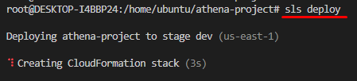  

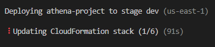  

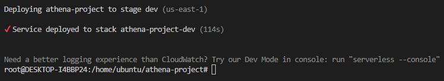  

Further you can check on AWS CloudFormation console to verify.  

  

## Step - 6
Finally you can cleanup your resources to avoid any extra charges  

```
$ sls remove
```  

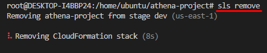  

  

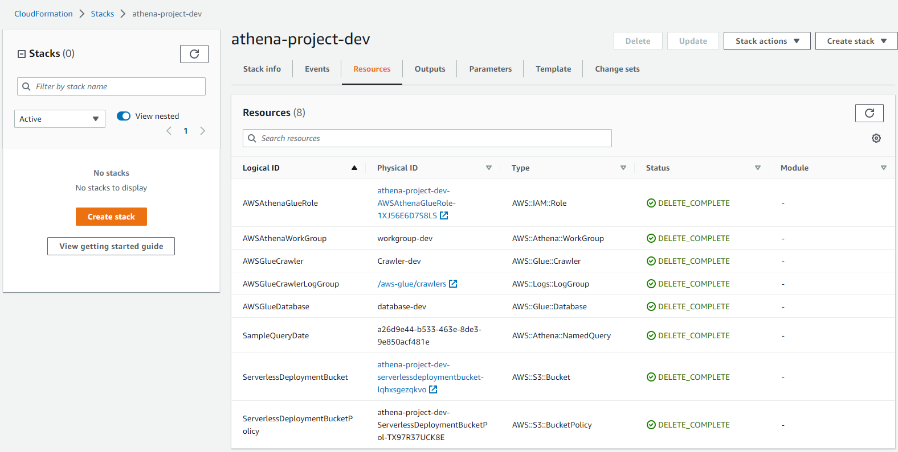  
